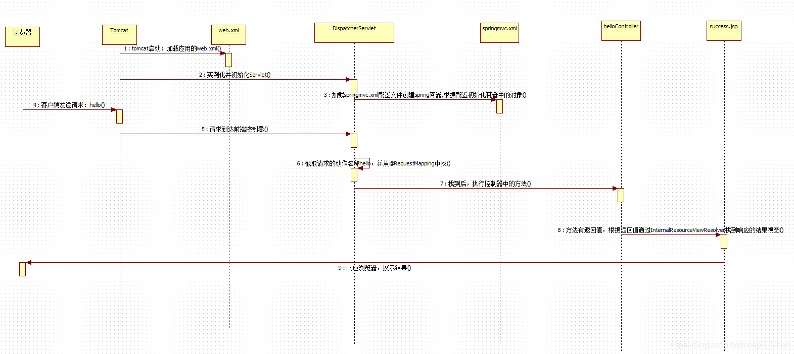
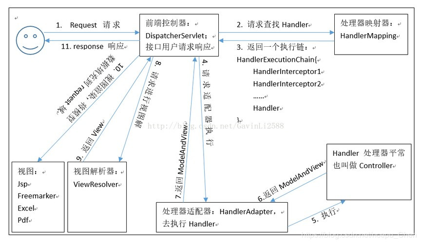
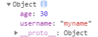

## 第一章：三层架构和MVC

### 1. 三层架构 

1. 咱们开发服务器端程序，一般都基于两种形式，一种C/S架构程序，一种B/S架构程序 
2. 使用Java语言基本上都是开发B/S架构的程序，B/S架构又分成了三层架构 
3. 三层架构
     1. 表现层：WEB层，用来和客户端进行数据交互的。表现层一般会采用MVC的设计模型 
     2. 业务层：处理公司具体的业务逻辑的 
     3. 持久层：用来操作数据库的 
### 2. MVC模型 

1. MVC全名是Model View Controller 模型视图控制器，每个部分各司其职。 
2. Model：数据模型，JavaBean的类，用来进行数据封装。
3. View：指JSP、HTML用来展示数据给用户
4. Controller：用来接收用户的请求，整个流程的控制器。用来进行数据校验等。 

##  第二章：SpringMVC的入门案例 

### 1. SpringMVC概述

1. 是一种基于Java实现的MVC设计模型的请求驱动类型的轻量级WEB框架。
2. Spring MVC属于SpringFrameWork的后续产品，已经融合在Spring Web Flow里面。Spring 框架提供 了构建 Web 应用程序的全功能 MVC 模块。
3. 使用 Spring 可插入的 MVC 架构，从而在使用Spring进行WEB开发时，可以选择使用Spring的 SpringMVC框架或集成其他MVC开发框架，如Struts1(现在一般不用)，Struts2等。
SpringMVC在三层架构中的位置：表现层框架 

### 2. 入门程序

1. 导入依赖

   ```xml
   <!-- 版本锁定 -->
   <properties>
   	<spring.version>5.0.2.RELEASE</spring.version>
   </properties>
   <dependencies>
       <dependency>
           <groupId>org.springframework</groupId>
           <artifactId>spring-context</artifactId>
           <version>${spring.version}</version>
       </dependency>
       <dependency>
           <groupId>org.springframework</groupId>
           <artifactId>spring-web</artifactId>
           <version>${spring.version}</version>
       </dependency>
       <dependency>
           <groupId>org.springframework</groupId>
           <artifactId>spring-webmvc</artifactId>
           <version>${spring.version}</version>
       </dependency>
       <dependency>
           <groupId>javax.servlet</groupId>
           <artifactId>servlet-api</artifactId>
           <version>2.5</version>
           <scope>provided</scope>
       </dependency>
       <dependency>
           <groupId>javax.servlet.jsp</groupId>
           <artifactId>jsp-api</artifactId>
           <version>2.0</version>
           <scope>provided</scope>
       </dependency>
   </dependencies>
   ```

2.  配置核心的控制器（配置DispatcherServlet） 

   - 在`web.xml`配置文件中	控制器`DispatcherServlet `

     ```xml
     <!DOCTYPE web-app PUBLIC
      "-//Sun Microsystems, Inc.//DTD Web Application 2.3//EN"
      "http://java.sun.com/dtd/web-app_2_3.dtd" >
     
     <web-app>
       <display-name>Archetype Created Web Application</display-name>
       <!--配置核心控制器-->
       <servlet>
         <servlet-name>dispatcherServlet</servlet-name>
         <servlet-class>org.springframework.web.servlet.DispatcherServlet</servlet-class>
         <!--配置载入配置文件-->
         <init-param>
           <param-name>contextConfigLocation</param-name>
           <param-value>classpath:springmvc.xml</param-value>
         </init-param>
         <!--配置启动时初始化-->
         <load-on-startup>1</load-on-startup>
       </servlet>
       <!--配置核心控制器映射-->
       <servlet-mapping>
         <servlet-name>dispatcherServlet</servlet-name>
         <url-pattern>/</url-pattern>
       </servlet-mapping>
     </web-app>
     ```

   - 编写`springmvc.xml`配置文件

     ```xml
     <?xml version="1.0" encoding="UTF-8"?>
     <beans xmlns="http://www.springframework.org/schema/beans"
            xmlns:xsi="http://www.w3.org/2001/XMLSchema-instance"
            xmlns:context="http://www.springframework.org/schema/context"
            xmlns:mvc="http://www.springframework.org/schema/mvc"
            xsi:schemaLocation="http://www.springframework.org/schema/beans
            http://www.springframework.org/schema/beans/spring-beans.xsd
            http://www.springframework.org/schema/context
            http://www.springframework.org/schema/context/spring-context.xsd
            http://www.springframework.org/schema/mvc
            http://www.springframework.org/schema/mvc/spring-mvc.xsd">
         <!--包扫描-->
         <context:component-scan base-package="com.ajacker"/>
         <!--视图解析器-->
         <bean id="resolver" class="org.springframework.web.servlet.view.InternalResourceViewResolver">
             <property name="prefix" value="/WEB-INF/pages/"/>
             <property name="suffix" value=".jsp"/>
         </bean>
         <!--mvc注解支持-->
         <mvc:annotation-driven/>
     </beans>
     ```

   - 编写控制器类

     ```java
     /**
      * @author ajacker
      * @date 2019/10/16 11:54
      */
     @Controller
     public class HelloController {
         @RequestMapping("/hello")
         public String sayHello(){
             System.out.println("hello springmvc!");
             return "success";
         }
     }
     ```

   - 编写页面

     `index.jsp`

     ```jsp
     <%@ page contentType="text/html;charset=UTF-8" language="java" %>
     <html>
     <head>
         <title>Title</title>
     </head>
     <body>
         <h3>入门程序</h3>
         <a href="/hello">入门程序</a>
     </body>
     </html>
     ```

     `WEB-INF/pages/sucess.jsp`

     ```jsp
     <%@ page contentType="text/html;charset=UTF-8" language="java" %>
     <html>
     <head>
         <title>入门成功</title>
     </head>
     <body>
         <h3>成功！</h3>
     </body>
     </html>
     ```

### 3. 入门案例的执行流程分析

1. 启动Tomcat服务器时,由于配置了`<load-on-startup>`标签,所以首先创建`DispatcherServlet`对象并加载`springmvc.xml`配置文件
2. 由于`springmvc.xml`中开启了注解扫描,`HelloController`对象被创建并加入Spring容器中
3. 浏览器请求`index.jsp`,请求会先到达`DispatcherServlet`核心控制器,根据配置`@RequestMapping`注解找到具体要执行的方法`sayHello()`
4. 执行方法`sayHello()`,得到返回值
5. 视图解析器解析返回值,查找到对应的JSP文件`success.jsp`
6. Tomcat服务器渲染页面,做出响应 

  

### 4. SpringMVC核心组件



- 前端控制器(核心控制器)`DispatcherServlet`:用户请求最先达到的控制器,**前端控制器调用其他组件处理请求**,是MVC架构中的C,是整个流程控制的核心.其存在降低了组件间的耦合性.
- 处理器映射器`HandlerMapping`:负责**根据用户请求找到处理器**.
- 处理器适配器`HandlAdapter`: **对处理器进行执行**.这是一种适配器模式的应用.
- 处理器`Handler`:具体的**业务方法**.
- 视图解析器`ViewResolver`: 负责将**处理结果生成视图**. `ViewResolver`首先根据逻辑视图名解析成物理视图名
  即具体的页面地址,再生成View视图对象,最后对View进行渲染将处理结果通过页面展示给用户.
- 视图`View`: 具体的页面

其中处理器映射器`HandlerMapping`,处理器适配器`HandlAdapter`,视图解析器`ViewResolver`称为`SpringMVC`三大组件.在`srpingmvc.xml`中声明`<mvc:annotation-driven conversion-service="conversionService"/>`标签相当于自动配置了处理器映射器和处理器适配器

## 第三章：处理请求

### 1. 请求路径的匹配`@RequestMapping`

`@RequestMapping`用于建立 `请求url`和`处理器方法`之间的映射关系

- 出现位置: 可以出现在类上,也可以出现在方法上.
  - 当它既出现在类上也出现在方法上时,类上注解值为请求URL的一级目录,方法上注解值为请求URL的二级目录
  - 当它只出现在方法上时,该注解值为请求URL的一级目录

- 其属性如下:

  - path: value属性的别名,指定请求的URL,支持Ant风格表达式,通配符如下:

    | 通配符 | 说明                                        |
    | ------ | ------------------------------------------- |
    | `?`    | 匹配文件(路径)名中的一个字符                |
    | `*`    | 匹配文件(路径)名中的任意数量(包括0个)的字符 |
    | `**`   | 匹配任意数量(包括0个)的路径                 |

    - `?`匹配文件(路径)名中的一个字符
    - `*`匹配文件(路径)名中的任意数量(包括0个)的字符
    - `**`匹配任意数量(包括0个)的路径

    例如

    - 路径`/project/*.a`匹配项目根路径下所有在`/project`路径下的`.a`文件
      *
    - 路径`/project/p?ttern`匹配项目根路径下的`/project/pattern`和`/project/pXttern,`但不能匹配`/project/pttern`
    - 路径`/**/example`匹配项目根路径下的`/project/example,/project/foo/example,`和`/example
      **`
    - 路径`/project/**/dir/file.*`匹配项目根路径下的`/project/dir/file.jsp,/project/foo/dir/file.html,/project/foo/bar/dir/file.pdf`
    - 路径`/**/*.jsp`匹配项目根路径下的所有jsp文件

  - `method:` 指定HTTP请求方法(可选`RequestMethod.GET,RequestMethod.HEAD,RequestMethod.POST,RequestMethod.PUT`等),多个值之间是或的关系.

  - `params`: 指定请求参数的限制,支持简单的表达式,如:

    - `@RequestMapping(params={"param1"})`,表示请求参数中param1必须出现
    - `@RequestMapping(params={"!param1"})`,表示请求参数中param1不能出现
    - `@RequestMapping(params={"param1=value1"})`,表示请求参数中param1必须出现且为value1
    - `@RequestMapping(params={"param1!value1"})`,表示请求参数中param1必须出现且不为value1

    多个值之间是与的关系

  - `headers`: 限定HTTP请求中必须包含的请求头,同样支持简单的表达式

### 2. URL占位符`@PathVaribale`

**REST风格URL**
REST风格URL有以下特点:

- 资源Resources: 通过一个URI来指定一个具体的资源

- 表现层Representation: 把资源具体呈现出来的形式

- 状态转化State Transfer: 通过HTTP请求方法来决定状态转化

  例如:

| REST风格URL             | 含义             |
| ----------------------- | ---------------- |
| `GET /accounts`         | 查找所有用户     |
| `POST /accounts`        | 新建用户         |
| `GET /accounts/{ID}`    | 查找对应ID的用户 |
| `PUT /accounts/{ID}`    | 更新对应ID的用户 |
| `DELETE /accounts/{ID}` | 删除对应ID的用户 |

**@PathVaribale注解的使用**

 在`@RequestMapping`注解的`path`属性中用`{param}`声明占位符,将展位符`@PathVariable`注解的`name`属性来修饰处理器参数来将占位符对应的值赋给方法的参数.例如 

```jsp
<a href="account/findAccount/10">查询账户</a>
```

```java
// 控制器类
@Controller
@RequestMapping(path = "/account")
public class HelloController {
    @RequestMapping("/findAccount/{id}")
    public void findAccount(@PathVariable(name = "id") Integer accountId) {
        System.out.println("accountId:"+accountId);
        return "success";
    }
}
```

访问地址` http://localhost:8080/findAccount/55 `后，得到输出`accountId:55`

### 3. 请求参数的绑定（`@RequestParam`）

**参数绑定的示例**

`SpringMVC`将请求参数中的`param=value`中的`value`传递给控制器方法的`param`参数,例如:

 对于以下请求和方法: 

```jsp
<a href="account/findAccount?accountId=10">查询账户</a>
```

```java
// 控制器类
@Controller
@RequestMapping(path = "/account")
public class HelloController {

	@RequestMapping(path = "/findAccount")
	public void findAccount(Integer accountId) {
		// accountId = 10
		// 方法体...
	}
}
```

**@RequestParam**(指定参数别名)

`@RequestParam`注解作用在方法参数上,把请求中指定名称的参数给处理器方法中的形参赋值,相当于给处理器方法起别名.其属性如下:

- `name`: `value`属性的别名,指定请求参数的名称
- `required`: 指定该请求参数是否必须的,默认为`true`

例如jsp中发送请求如下

```jsp
<a href="testRequestParam?param1=value">测试requestParam注解</a>
```

```java
@RequestMapping("/testRequestParam")
public String handlerMethod(@RequestParam("param1") String username) {
    // 方法体...
}
```

#### 1. 基本数据类型

```jsp
<a href="account/findAccount?accountId=10&accountName=zhangsan">查询账户</a>
```

```java
// 控制器类
@Controller
@RequestMapping(path = "/account")
public class HelloController {

    @RequestMapping("/findAccount")
    public String findAccount(Integer accountId, String accountName) {
        // accountId = 10, accountName = "zhangsan"
        // 方法体...
    }
}
```

#### 2. javabean类型

1. 若JavaBean参数的属性中只包含基本数据类型和String类型属性,以属性名作为请求参数名,则SpringMVC会自动将其封装成JavaBean对象.示例如下:

   例如JavaBean类的定义如下:

   ```java
   // JavaBean类
   public class Account implements Serializable {
       private String username;
       private Integer age;
       // 所有属性的getset方法...
   }
   ```

   则其对应的请求参数名如下:

   ```html
   <form action="account/updateAccount" method="post">
       <label>名称</label><input type="text" name="username"><br/>
       <label>年龄</label><input type="text" name="age"><br/>
       <input type="submit" value="保存">
   </form>
   ```

   控制器方法可以：

   ```java
   @RequestMapping("/updateAccount")
   public String findAccount(Account account){
       System.out.println("account:"+account);
       return "success";
   }
   ```

2. 若JavaBean参数的属性中**包含其它JavaBean对象**,则以外层类属性名.内层类属性名作为请求参数,示例如下:

   例如JavaBean类的定义如下:

   ```java
   public class Account implements Serializable {
       private String username;
       private Intger age;
       private User user;
   	// 所有属性的getset方法...
   }
   
   public class User implements Serializable{
       private String uname;
       private Double umoney;
       // 所有属性的getset方法...
   }
   ```

   则对应的请求参数名如下：

   ```html
   <form action="account/updateAccount" method="post">
       <label>名称</label><input type="text" name="username"><br/>
       <label>年龄</label><input type="text" name="age"><br/>
       <label>用户名</label><input type="text" name="user.uname"><br/>
       <label>用户余额</label><input type="text" name="user.umoney"><br/>
       <input type="submit" value="保存">
   </form>
   ```

#### 3. 集合类型的参数绑定

对`JavaBean`类中的集合属性进行参数绑定,可以分为List类型的参数绑定和Set类型的参数绑定

- 对于`List`类型参数,其请求参数名为`集合名[下标]`,List类型参数可以对List,Set,数组类型成员进行赋值,但是诡异的是对Set和数组成员进行赋值时,要在Bean类的构造函数中new出对应的Set或数组
- 对于`Set`类型参数,其请求参数名为`集合名[键]`,Set类型参数可以对Set,Propertis类型成员进行赋值.
  例如JavaBean类的定义如下:

```java
public class Account implements Serializable {

    private String username;
    private Intger age;
    private List<User> list;		// List集合属性
    private Map<String, User> map;	// Map集合属性

	// 所有属性的getset方法...
}

public class User implements Serializable{

    private String uname;
    private Double umoney;
    
    // 所有属性的getset方法...
}
```

则其对应的请求参数名如下:

```html
<form action="account/updateAccount" method="post">
	用户名称：<input type="text" name="username"><br/>
	用户密码：<input type="password" name="password"><br/>
	用户年龄：<input type="text" name="age"><br/>
	账户1名称：<input type="text" name="accounts[0].name"><br/>
	账户1金额：<input type="text" name="accounts[0].money"><br/>
	账户2名称：<input type="text" name="accounts[1].name"><br/>
	账户2金额：<input type="text" name="accounts[1].money"><br/>
	账户3名称：<input type="text" name="accountMap['one'].name"><br/>
	账户3金额：<input type="text" name="accountMap['one'].money"><br/>
	账户4名称：<input type="text" name="accountMap['two'].name"><br/>
	账户4金额：<input type="text" name="accountMap['two'].money"><br/>
	<input type="submit" value="保存">
</form>
```

#### 4. 自定义数据类型参数绑定

表单提交的任何数据类型都是字符串类型,`SpringMVC`定义了转换器,将字符串转化为我们方法参数的各种类型.我们也可以实现**自定义的转换器以实现自定义的参数类型转换**
自定义的类型转换器要实现`Converter<String, T>`接口,并在Spring容器配置`bean.xml`中配置该实现类. 示例如下:

在工程的java目录下创建控制器类`com.ajacker.util.StringToDateConverter`类,实现`Converter<String, Date>`接口,完成从String类到Date类的转换

```java
public class StringToDateConverter implements Converter<String, Date> {
    @Override
    public Date convert(String source) {
        try {
            DateFormat df = new SimpleDateFormat("yyyy-MM-dd");
            return df.parse(source);
        } catch (Exception e) {
            throw new RuntimeException("类型转换错误");
        }
    }
}
```

在Spring容器配置`springmvc.xml`中加入如下配置:

```xml
<!-- 配置的类型转换器工厂 -->
<bean id="conversionService" class="org.springframework.context.support.ConversionServiceFactoryBean">
    <property name="converters">
        <set>
            <!-- 诸如我们自定义的类型转换器 -->
            <bean class="com.ajacker.util.StringToDateConverter"/>
        </set>
    </property>
</bean>
```

#### 5. 通过原始ServletAPI对象处理请求

 SpringMVC支持使用原始ServletAPI作为控制器方法的参数,包括`HttpServletRequest`,`HttpServletResponse`,`HttpSession`对象,他们都可以直接用做控制器方法的参数.示例如下: 

```java
@RequestMapping("/path")
public void myHandler(HttpServletRequest request, HttpServletResponse response) throws IOException {
    System.out.println(request.getParameter("param1"));
    System.out.println(request.getParameter("param1"));
    response.getWriter().println("<h3>操作成功</h3>");
}
```

### 4. 解决请求参数绑定中文乱码问题

`web.xml`配置编码转换过滤器(**解决post请求的**)

```xml
<!-- 配置编码转换过滤器 -->
<filter>
	<filter-name>characterEncodingFilter</filter-name>
	<filter-class>org.springframework.web.filter.CharacterEncodingFilter</filterclass>
	<!-- 指定字符集 -->
	<init-param>
		<param-name>encoding</param-name>
		<param-value>UTF-8</param-value>
	</init-param>
    <init-param>
        <param-name>forceEncoding</param-name>
        <param-value>true</param-value>
    </init-param>
</filter>
<!-- 过滤所有请求 -->
<filter-mapping>
	<filter-name>characterEncodingFilter</filter-name>
	<url-pattern>/*</url-pattern>
</filter-mapping>
```

配置tomcat下的`conf/server.xml`配置（**解决get请求的**）

```xml
<Connector port="8080"  
protocol="HTTP/1.1" 　connectionTimeout="20000" 　
redirectPort="8443"/>
改成：
<Connector port="8080"  
protocol="HTTP/1.1" 　connectionTimeout="20000" 　
redirectPort="8443" 　
URIEncoding="UTF-8"/>
```

为tomcat运行配置添加`VM Options`（**解决控制台输出的**）

```
 -Dfile.encoding=UTF-8
```

## 第四章：响应数据和结果视图

### 1. 通过处理器方法返回值指定返回视图

SpringMVC中的处理器方法的返回值用来指定页面跳转到哪个视图,处理器的返回值可以为`String`,`void`,`ModelAndView`对象.

- 处理器返回`String`对象: 转发到字符串指定的URL

  处理器方法返回字符串可以指定逻辑视图名,通过视图解析器解析为物理视图地址.

  在本例中,因为我们在Spring容器配置文件`springmvc.xml`中配置的视图解析器中注入prefix和suffix属性,所以视图解析器会把处理器返回的"字符串值"解析为`"/WEB-INF/pages/字符串值.jsp"`,再请求对应视图.这是一个**请求转发**过程,浏览器**地址栏不会发生变化**.

  `springmvc.xml`中配置的视图解析器如下:

  ```xml
  <bean id="viewResolver" class="org.springframework.web.servlet.view.InternalResourceViewResolver">
      <property name="prefix" value="/WEB-INF/pages/"></property>
      <property name="suffix" value=".jsp"></property>
  </bean>
  ```

  转发的地址会被拼接为：`/WEB-INF/pages/<string>.jsp`

  处理器方法如下:

  ```java
  @Controller
  @RequestMapping("/return")
  public class ReturnController {
  
      @RequestMapping("/testString")
      public String testString(Model model) {
  		// 执行方法体...向隐式对象添加属性attribute_user,可以在jsp中通过 ${attribute_user} 获取到
  		model.addAttribute("attribute_user", new User("张三", "123"));
          // 经过视图解析器的处理,SpringMVC会将请求转发到/WEB-INF/pages/succeess.jsp,但浏览器地址栏显示的一直是 项目域名/user/testString
          return "success";
      }
  }
  ```

- ###### 处理器返回`void`: 转发到当前URL

  若处理器返回`void`,表示执行完处理器方法体内代码后,不进行请求转发,而直接转发到当前URL.若没有在`web.xml`中配置当前对应的`url-pattern`,则会返回`404`错误.

  ```java
  @Controller
  @RequestMapping("/return")
  public class ReturnController {
  
      @RequestMapping("/testVoid")
      public void testVoid(Model model) {
  		// 执行方法体...向隐式对象添加属性attribute_user,可以在jsp中通过 ${attribute_user} 获取到
  		model.addAttribute("attribute_user", new User("张三", "123"));
          // 处理器没有返回值,则会将请求转发到当前 项目域名/user/testVoid 路径
          // 若在web.xml中没有配置 项目域名/user/testVoid 对应的url-pattern,则会返回404错误
          return;
      }
  }
  ```

  可以在返回语句之前执行请求转发,重定向或`getWriter`方法指定视图,示例如下:

  ```java
  @Controller
  @RequestMapping("/return")
  public class ReturnController {
  
          @RequestMapping("/testVoid")
          public void testVoid(HttpServletRequest request, HttpServletResponse response) throws Exception {
              // 执行方法体...向隐式对象添加属性attribute_user,可以在jsp中通过 ${attribute_user} 获取到
              model.addAttribute("attribute_user", new User("张三", "123"));
  
              // 通过下面三个方法之一,可以指定访问的视图
              // 指定视图的方式1: 请求转发
              request.getRequestDispatcher("/WEB-INF/pages/success.jsp").forward(request,response);
  
              // 指定视图的方式2: 重定向
              response.sendRedirect(request.getContextPath() + "/index.jsp");
  
              // 指定视图的方式3: 通过Writer对象写入内容
              response.setCharacterEncoding("UTF-8");
              response.setContentType("text/html;charset=UTF-8");
              response.getWriter().print("你好");
  
              return;
          }
  }
  ```

- ###### 处理器返回`ModelAndView`对象: 更灵活地添加属性和指定返回视图

  ModelAndView为我们提供了一种更灵活地为页面添加属性和指定返回视图的方法,其主要方法如下:

  - `public ModelMap getModelMap()`: 返回当前页面的`ModelMap`对象.
  - `public ModelAndView addObject(Object attributeValue)`: 向当前页面的`ModelMap`对象中添加属性
  - `public void setViewName(@Nullable String viewName)`: 指定返回视图,`viewName会`先被视图解析器处理解析成对应视图.

  ```java
  @Controller
  @RequestMapping("/return")
  public class ReturnController {
  
  	@RequestMapping("/testModelAndView")
      public ModelAndView testModelAndView() {
          
          // 创建ModelAndView对象
          ModelAndView mv = new ModelAndView();
          
          // 向model中存入属性attribute_user
  		mv.addObject("attribute_user", new User("张三", "123"));
  
          // 指定返回视图,视图解析器将"success"解析为视图URL /WEB-INF/pages/succeess.jsp
          mv.setViewName("success");
          return mv;
      }
  }
  ```

### 2. SpringMVC框架提供的请求转发和重定向

- 使用SpringMVC框架提供的请求转发:

  要使用`SpringMVC`框架提供的请求转发,只需要在处理器方法返回的`viewName`字符串首加上`forward:`即可,要注意的是,此时`forward:`后的地址不能直接被视图解析器解析,因此要写完整的相对路径.示例如下: 

  ```java
  @Controller
  @RequestMapping("/return")
  public class ReturnController {
  	@RequestMapping("/testForward")
      public String testForward() {
          // 在forward:要写完整的相对路径
          // return "forward:success"	// 错误,会将请求转发到 /项目名/user/success
          return "forward:/WEB-INF/pages/success.jsp";
      }
  }
  ```

- ###### 使用SpringMVC框架提供的重定向

  要使用`SpringMVC`框架提供的请求重定向,只需要在处理器方法返回的`viewName`字符串首加上`redirect:`即可,要注意的是,此时`redirect:`后的地址要写相对于`ContextPath`的地址.示例如下: 

  ```java
  @Controller
  @RequestMapping("/return")
  public class ReturnController {
  	@RequestMapping("/testRedirect")
      public String testRedirct() {
          // 在forward:要写完整的相对路径
          // return "redirect:" + request.getContextPath() + "/index.jsp";	// 错误,会将请求转发到 /项目名/项目名/index.jsp
  		return "redirect:/index.jsp";
      }
  }
  ```

### 3. SpringMVC响应json数据

	#### 1. 前期准备

jsp在页面上引入jQuery以发送json数据,因此需要向服务器发起一个对jQuery的请求.像这种对静态资源的请求,不应当经过具体的某个处理器处理,而应当直接返回对应的静态资源.

因此我们需要在Spring容器配置`springmvc.xml`中使用`<mvc:resources>`标签声明该资源为静态资源,否则请求该资源会报404错误.该标签的属性如下:

- `location`属性: 表示该资源在服务器上所在的位置,必须是一个有效的目录
- `mapping`属性: 指定匹配的URL

1. 我们在`springmvc.xml`中配置各静态文件的位置如下:

```xml
<mvc:resources location="/img/" mapping="/img/**"/>
<mvc:resources location="/js/" mapping="/js/**"/>
<mvc:resources location="/css/" mapping="/css/**"/>
```

也可以使用` <mvc:default-servlet-handler /> `放过所有静态资源

2. 要将json字符串与JavaBean对象相互转换,我们需要引用`jackson`的jar包,在`pom.xml`中添加依赖坐标如下: 

```xml
<dependency>
    <groupId>com.fasterxml.jackson.core</groupId>
    <artifactId>jackson-databind</artifactId>
    <version>2.9.0</version>
</dependency>
<dependency>
    <groupId>com.fasterxml.jackson.core</groupId>
    <artifactId>jackson-core</artifactId>
    <version>2.9.0</version>
</dependency>
<dependency>
    <groupId>com.fasterxml.jackson.core</groupId>
    <artifactId>jackson-annotations</artifactId>
    <version>2.9.0</version>
</dependency>
```

这里应该也可以用`fastjson`、`Gson`等

#### 2. 在jsp中编写代码发送json数据

```jsp
<script src="/js/jquery-3.4.1.min.js"></script>
<script>
    // 页面加载，绑定单击事件
    $(function () {
        $("#btn").click(function () {
            // 发送ajax请求
            $.ajax({
                // 配置请求参数
                url: "/account/testAjax",
                contentType: "application/json;charset=UTF-8",
                dataType: "json",
                type: "post",
                // 请求的json数据
                data: '{"username":"myname","age":30}',
                // 回调函数,处理服务器返回的数据returnData
                success: function (returnData) {
                    // 我们假定服务器返回的是一个account对象,将其输出在控制台上
                    console.log(returnData);            }
            });
        });
    });
</script>
```

#### 3. 编写控制器中的处理方法

使用`@RequestBody`注解将请求体绑定到控制器方法参数上,使用`@ResponseBody`注解表示将该方法的返回值直接写回到HTTP响应中,而不是存入`Model`或解析为视图名.

我们引入的`jackson`包**自动完成从Java实体类到json数据之间的相互转换**.

```java
@RequestMapping("/testAjax")
@ResponseBody
public Account testAjax(@RequestBody Account account) {
    System.out.println(account);
    // 将account对象返回给前端页面
    return account;
}
```

 我们看到前端页面收到了我们返回的user对象.



​	

## 第五章：文件上传

### 1. 文件上传的原理

- 实现文件上传的前提
  - `<form>`表单的`enctype`属性取值必须是`multipart/form-data`(默认值是`application/x-www-form-urlencoded`),表示表单内容是分块的.这时`request`对象的`getParameter()`方法将失效.

  - `<form>`表单的`method`属性取值必须是post,因为get请求长度有限制.

  - 提供一个`<input/>`标签,用来选择上传文件.

  ```jsp
  <form action="/fileUpload/uploadHandler" method="post" enctype="multipart/form-data">
      选择文件<input type="file" name="fileParam"/><br/>
      <input type="submit" value="上传文件"/>
  </form>
  ```

  -  引用文件上传的相关jar包 

    ```xml
    <dependency>
        <groupId>commons-fileupload</groupId>
        <artifactId>commons-fileupload</artifactId>
        <version>1.3.1</version>
    </dependency>
    <dependency>
        <groupId>commons-io</groupId>
        <artifactId>commons-io</artifactId>
        <version>2.4</version>
    </dependency>
    ```

- 文件表单内容

  因为我们设置了`enctype`属性取值为`multipart/form-data`,因此在请求参数头中会有一项`Content-Type:multipart/form-data; boundary=----WebKitFormBoundaryOMtUEa1sSZ3ayCfC`,表示当前表单内容数据是分块的,每两块之间以`----WebKitFormBoundaryOMtUEa1sSZ3ayCfC`分界.

  服务器通过遍历每一块数据,找到文件所在的数据块并执行保存.

### 2. 文件上传的三种实现

#### 1. 使用JavaEE进行文件上传

传统的JavaEE文件上传思路是通过解析`request`对象,获取表单中的上传文件项并执行保存.

```java
@RequestMapping("/uploadHandler")
public String handleUpload(HttpServletRequest request) throws Exception {
    System.out.println("文件上传");
    //
    String path = request.getSession().getServletContext().getRealPath("/uploads");
    //判断路径不存在就创建
    File file = new File(path);
    if (!file.exists()){
        file.mkdirs();
    }
    //解析request对象，获取上传文件项
    DiskFileItemFactory factory = new DiskFileItemFactory();
    ServletFileUpload upload = new ServletFileUpload(factory);
    //解析request
    List<FileItem> fileItems = upload.parseRequest(request);
    //遍历创建文件
    fileItems.removeIf(FileItem::isFormField);
    for (FileItem fileItem : fileItems) {
        String fileName = fileItem.getName();
        //文件名称设置唯一值
        String uuid = UUID.randomUUID().toString().replaceAll("-", "");
        fileName = uuid+"_"+fileName;
        fileItem.write(new File(path, fileName));
        //删除临时文件
        fileItem.delete();
    }
    return "success";
}
```

#### 2. 使用SpringMVC进行单服务器文件上传

- 在`springmvc.xml`配置文件解析器对象(必须叫这个id)

  ```xml
  <!--配置文件解析器对象-->
  <bean id="multipartResolver" class="org.springframework.web.multipart.commons.CommonsMultipartResolver">
  </bean>
  ```

- 编写控制器中的相关代码

  ```java
  @RequestMapping("/mvcUploadHandler")
  public String mvcHandleUpload(HttpServletRequest request,@RequestParam("fileParam") MultipartFile upload) throws Exception {
      System.out.println("文件上传");
      //
      String path = request.getSession().getServletContext().getRealPath("/uploads");
      //判断路径不存在就创建
      File file = new File(path);
      if (!file.exists()){
          file.mkdirs();
      }
      String fileName = upload.getOriginalFilename();
      //文件名称设置唯一值
      String uuid = UUID.randomUUID().toString().replaceAll("-", "");
      fileName = uuid+"_"+fileName;
      upload.transferTo(new File(path, fileName));
      return "success";
  }
  ```

#### 3. 使用SpringMVC进行跨服务器文件上传

- 导入库进行服务器通信

  ```xml
  <dependency>
      <groupId>com.sun.jersey</groupId>
      <artifactId>jersey-core</artifactId>
      <version>1.18.1</version>
  </dependency>
  <dependency>
      <groupId>com.sun.jersey</groupId>
      <artifactId>jersey-client</artifactId>
      <version>1.18.1</version>
  </dependency>
  ```

- 编写控制器中的相关代码

  ```java
  @RequestMapping("/betweenUploadHandler")
  public String betweenHandleUpload(@RequestParam("fileParam") MultipartFile upload) throws Exception {
      //文件上传服务器包
      String path = "http://127.0.0.1:9090/uploads/";
      String fileName = upload.getOriginalFilename();
      //文件名称设置唯一值
      String uuid = UUID.randomUUID().toString().replaceAll("-", "");
      fileName = uuid+"_"+fileName;
      //创建客户端
      Client client = Client.create();
      //连接图片服务器
      WebResource resource = client.resource(path + fileName);
      //上传文件
      resource.put(upload.getBytes());
      return "success";   
  }
  ```

## 第六章：注解介绍

### 1. `@RequestBody`

```java
@RequestMapping("/testRequestBody")
public String testRequestBody(@RequestBody String body){
    System.out.println("执行了...");
    System.out.println(body);
    return "success";
}
```

- 对于get请求，请求体是一个类似于` username=abc&age=12 `的字符串，
- 对于post请求，如果有相关的包，可以把json自动封装成实体类

### 2. `@RequestHeader`

```java
@RequestMapping("/testRequestHeader")
public String testRequestHeader(@RequestHeader("Accept") String header){
    System.out.println("执行了...");
    System.out.println(header);
    return "success";
}
```

- `value`:指定要获取的请求头字段

### 3. `@CookieValue`

```java
@RequestMapping("/testCookie")
public String testCookie(@CookieValue("JSESSIONID") String cookie){
    System.out.println("执行了...");
    System.out.println(cookie);
    return "success";
}
```

-  `value`:指定cookie的名称

### 4. `@ModelAttribute`

1. 单独使用且返回值为void

   ```java
   @ModelAttribute
   public void searchUser(Map<String,Object> map,@RequestParam("name") String name){
       User user = new User();
       user.setName(name);
       user.setId("xxx");
       map.put("user1", user);
   }
   ```

   - 可以借助map和model将数据模型放入request域
   - 先于`@RequestMapping`修饰的方法执行

2. 单独使用且返回POJO但未指定属性

   ```java
   @ModelAttribute
   public User searchUser(@RequestParam("name") String name){
       User user = new User();
       user.setName(name);
       user.setId("xxx");
       return user;
   }
   ```

   - 以类型名首字符小写为`key`（如`"user"`），返回值为`value`放入request域
   - 先于`@RequestMapping`修饰的方法执行

3. 单独使用返回POJO且指定了属性

   ```java
   @ModelAttribute("user2")
   public User searchUser(@RequestParam("name") String name){
       User user = new User();
       user.setName(name);
       user.setId("xxx");
       return user;
   }
   ```

   - 以`value`属性为`key`（如`"user2"`），返回值为`value`放入request域
   - 先于`@RequestMapping`修饰的方法执行

4. 和`@RequestMapping`同时使用

   ```java
   @ModelAttribute("user")
   @RequestMapping("/testModelAttribute")
   public User testModelAttribute(String name){
       User user = new User();
       user.setName(name);
       user.setId("xxx");
       return user;
   }
   ```

   - 以`value`属性为`key`（如`"user"`），返回值为`value`放入request域
   - 返回的视图为请求路径的对应视图（例如这个就是`"/WEB-INF/pages/testModelAttribute.jsp"`）
   - 不会先于其它方法执行

   - 这样修饰的方法不能使用`@RequestParam`注解，不知道为什么会报错

5. 注解在参数上

   ```java
   @RequestMapping("/testModelAttribute2")
   public User testModelAttribute2(@ModelAttribute("result") User user){
       System.out.println(user);
       return "hello";
   }
   ```

   - 从model中以`value`属性为key，取出value赋值给user

### 5. `@SessionAttribute`

```java
@Controller
@RequestMapping("session")
@SessionAttributes({"username","password","age"})
public class SessionController {
    @RequestMapping("/testPut")
    public String testPut(Model model){
        model.addAttribute("username", "泰斯特");
        model.addAttribute("password","123456");
        model.addAttribute("age", 31);
        //跳转之前将数据保存到 username、password 和 age 中，因为注解@SessionAttribute 中有 这几个参数
        return "success";}

    @RequestMapping("/testGet")
    public String testGet(ModelMap model){
        System.out.println(model.get("username")+";"+model.get("password")+";"+model.get("age"));
        return "success";
    }

    @RequestMapping("/testClean")
    public String complete(SessionStatus sessionStatus){
        sessionStatus.setComplete();
        return "success";
    }
}
```

- 注解在类上，指名哪些属性在存到request域的同时存放到Session域

## 第七章：异常处理

异常处理可以让我们在出现异常的时候给用户展现自定义的页面

1. 合适的抛出异常

   ```java
   @Controller
   @RequestMapping("/error")
   public class ErrorController {
       @RequestMapping("/testException")
       public String testException() throws SysException {
           System.out.println("testException"+"执行了");
           try {
               int i = 1/0;
           } catch (Exception e) {
               e.printStackTrace();
               throw new SysException("出现系统异常");
           }
           return "success";
       }
   }
   ```

2. 编写自定义异常类(也可以用自带的异常)

   ```java
   /**
    * @author ajacker
    * @date 2019/10/18 13:40
    */
   public class SysException extends Exception {
       private String message;
       public SysException(String message) {
           this.message = message;
       }
       @Override
       public String getMessage() {
           return message;
       }
       public void setMessage(String message) {
           this.message = message;
       }
   }
   
   ```

3. 编写异常处理器(要求实现接口` HandlerExceptionResolver`)

   ```java
   /**
    * @author ajacker
    * @date 2019/10/18 13:43
    * 异常处理器
    */
   public class SysExceptionResolver implements HandlerExceptionResolver {
       @Override
       public ModelAndView resolveException(HttpServletRequest httpServletRequest, HttpServletResponse httpServletResponse, Object o, Exception e) {
           SysException ex = null;
           if (e instanceof SysException){
               ex = (SysException) e;
           }else {
               ex = new SysException("出现其它异常");
           }
           //创建ModelAndView
           ModelAndView mv = new ModelAndView();
           mv.addObject("errorMsg", ex.getMessage());
           mv.setViewName("error");
           return mv;
       }
   }
   ```

4. 在`springmvc.xml`中配置bean

   ```xml
   <!--配置异常处理器-->
   <bean id="sysExceptionResolver" class="com.ajacker.exception.SysExceptionResolver"/>
   ```

   


